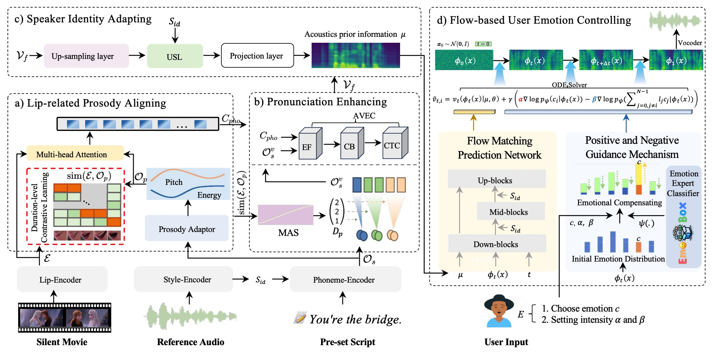

<p align="center">
  
</p>
<div align="center">
  <h3 class="papername"> 
    EmoDubber: Towards High Quality and Emotion Controllable Movie Dubbing </h3>
</div>


[](https://github.com/GalaxyCong/DubFlow)
[](https://arxiv.org/pdf/2412.08988)
[](https://github.com/GalaxyCong/DubFlow)
[](https://galaxycong.github.io/EmoDub/)


# 

# 🗒 TODO List
- [✓] Release EmoDubber's training and inference code (Basic Fuction). (Fixed on 5/27/2025)
- [✓] Upload pre-processed dataset features to Baidu Cloud and Google Cloud. (Done 5/27/2025)
- [-] Release model checkpoint (Basic Fuction) to inference waveform. (Before 6/1/2025)
- [-] Release EmoDubber's emotion controlling code (Emotion Fuction). 
- [-] Provide metrics testing scripts (LSE-C, LSE-D, SECS, WER, MCD). 




# Environment

1. Clone this repository:
```bash
git clone https://github.com/GalaxyCong/EmoDubber.git
cd EmoDubber
```
2. Create an environment
```bash
conda create -n emodub python=3.10 -y
conda activate emodub
```
3. Install python requirements: 
```bash
pip install -r requirements.txt
```
4. Install [monotonic_align](https://github.com/resemble-ai/monotonic_align)
```bash
pip install git+https://github.com/resemble-ai/monotonic_align.git
```
5. Final step. Download [trainer.py](https://drive.google.com/file/d/1pfMlL22zz8xDcLYtN_cUTp8lMUquN4zD/view?usp=sharing) and replace your ```anaconda3/envs/emodub/lib/python3.10/site-packages/lightning/pytorch/trainer/trainer.py```;  
Download [checkpoint_connector.py](https://drive.google.com/file/d/1KkLOEsmG82znIHOIN0iHEfqR6ZyLY8yb/view?usp=sharing) and replace your ```anaconda3/envs/emodub/lib/python3.10/site-packages/lightning/pytorch/trainer/connectors/checkpoint_connector.py```

(Note: Step5 is to prevent the error of Missing key(s) in state_dict (TTS_model.ckpt >> EmoDubber_all). I avoid this problem by setting "strict=False" in torch lightning.)


# Prepare Data Feature

When performing training, both Raw Audio and Prosessed Features need to be downloaded. 
When inferencing, only Prosessed Features are needed. 

## Chem 

- Chem 16KHz Raw Audio: [Google Drive](https://drive.google.com/file/d/1gPwUePAkJFZJ5Xm7YrOuxCQN5NIbG5iF/view?usp=sharing) || [Baidu Drive](https://pan.baidu.com/s/1RD7gzSs3XeimTJVJOkkjxA)(erap)


- Chem Prosessed Feature: [Google Drive](https://drive.google.com/file/d/1xwx5cD8t24JPu3_t-Rqwreg0iH6rj5a1/view?usp=sharing) || [Baidu Drive](https://pan.baidu.com/s/198s3QM_Fi47kCPe6umzxyA)(nriv)


## GRID

- GRID 16KHz Raw Audio: [Google Drive](https://drive.google.com/file/d/1V0wyhmEKwB4N58w0GO4AX9WSLFLn86LE/view?usp=sharing) || [Baidu Drive](https://pan.baidu.com/s/174hmeiareDW51IG_a58AFg)(xikd)

- GRID Prosessed Feature: [Google Drive](https://drive.google.com/file/d/13h_htzQwZfZDEtfQ6BF-Y-99uAiSxyEA/view?usp=sharing) || [Baidu Drive](https://pan.baidu.com/s/1vpoaiXfYnu5RPmu3OKmkew)(cbdy)


# Train Your Own Model

1. Ensure input path is correct (see ```configs/data/Chem_dataset.yaml``` or ```configs/data/GRID_dataset```).
2. Download [TTS_model.ckpt](https://drive.google.com/file/d/14NbtYF07fKxw13MQJfhtD2NwizRpJFY5/view?usp=sharing) (pretraining on LibriTTS-clean-100 dataset) and save it in ```Pretrained_TTSmodel``` folder. 
3. Finally, please stay in root directory, and run directly: 
```bash
python EmoDubber_Networks/Train_EmoDubber_Chem16K.py
```
or
```bash
python EmoDubber_Networks/Train_EmoDubber_GRID16K.py
```


# Our Checkpoints

We will provide our Checkpoints. 

Baidu Drive, Google Drive

# Inference 

Download our [16k Hz Vocoder](https://drive.google.com/file/d/1XXCSYbIEjePcWT8jNwSWeLlIQf0M-2pp/view?usp=sharing) to equip EmoDubber and save it to the ```Vocoder_16KHz``` folder (ie, keep the same level as ```config.json```). 


Then, please run directly for inference (stay in root): 
```bash
python EmoDubber_Networks/Inference_Chem_Unbatch_New.py --checkpoint_path "-path" --vocoder_checkpoint_path "-path" --Val_list "-path" --Silent_Lip "-path" --Silent_Face "-path" --Refence_audio "-path"
```

or

```bash
python EmoDubber_Networks/Inference_GRID_Unbatch_New.py --checkpoint_path "-path" --vocoder_checkpoint_path "-path" --Val_list "-path" --Silent_Lip "-path" --Silent_Face "-path" --Refence_audio "-path"
```


# Emotion Controlling  
Under construction

## Training emotional expert classifier


Under construction


# License

Code: MIT License


# Citing

If you find our work useful, please consider citing:
```BibTeX
@article{cong2024emodubber,
  title={EmoDubber: Towards High Quality and Emotion Controllable Movie Dubbing},
  author={Cong, Gaoxiang and Pan, Jiadong and Li, Liang and Qi, Yuankai and Peng, Yuxin and Hengel, Anton van den and Yang, Jian and Huang, Qingming},
  journal={arXiv preprint arXiv:2412.08988},
  year={2024}
}
```

# Contact

My email is gaoxiang.cong@vipl.ict.ac.cn


Any discussions and suggestions are welcome!


