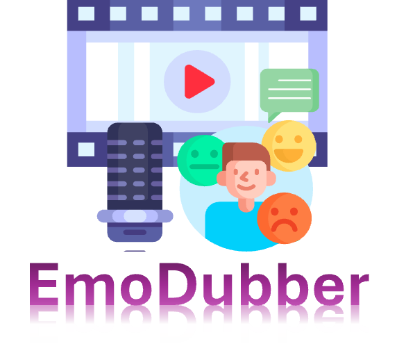

<p align="center">
  
</p>
<div align="center">
  <h3 class="papername"> 
    EmoDubber: Towards High Quality and Emotion Controllable Movie Dubbing </h3>
</div>


[](https://github.com/GalaxyCong/DubFlow)
[](https://arxiv.org/pdf/2412.08988)
[](https://github.com/GalaxyCong/DubFlow)
[](https://galaxycong.github.io/EmoDub/)


# 

# 🗒 TODO List
- [✓] Release EmoDubber's training and inference code (Basic Fuction).
- [-] Upload pre-processed dataset features to Baidu Cloud and Google Cloud. 
- [-] Release EmoDubber's emotion controlling code (Emotion Fuction). 
- [-] Release all model checkpoint to inference. 
- [-] Provide metrics testing scripts (LSE-C, LSE-D, SECS, WER, MCD). 
- [-] Reorganize the complete guide to README.md. 


# Environment
1. Python >= 3.10
2. Clone this repository:
```bash
git clone https://github.com/GalaxyCong/EmoDubber.git
cd EmoDubber
```
3. Install python requirements: 
```bash
pip install -r requirements.txt
```
4. Install [monotonic_align](https://github.com/resemble-ai/monotonic_align)
```bash
pip install git+https://github.com/resemble-ai/monotonic_align.git
```

# Prepare Data Feature

We will provide directly pre-processed data features. 

- Chem dataset

Baidu Drive, Google Drive

- GRID dataset

Baidu Drive, Google Drive

# Train Your Own Model

After downloading the data features, check whether the path is correct in train_filelist_path, valid_filelist_path, ...., and GT_SIM_path, etc (see ```configs/data/Chem_dataset.yaml``` and ```configs/data/GRID_dataset```).   
Then, please stay in the root directory of the project, and run directly: 
```bash
python EmoDubber_Networks/Train_EmoDubber_Chem16K.py
```
or
```bash
python EmoDubber_Networks/Train_EmoDubber_GRID16K.py
```


# Our Checkpoints

Baidu Drive, Google Drive

# Inference 

Download our 16k Hz Vocoder for EmoDubber and save it to the Vocoder_16KHz folder (on the same level as config.json). 
Please note that the 16K Hz Vocoder is still based on HiFi-GAN, this is just for a fair comparison, we also agree to use the more advanced BigVGAN-V2 or Vocos if you need. 

Then, please run directly for inference (stay in the root directory): 
```bash
python EmoDubber_Networks/Inference_Chem_Unbatch_New.py --checkpoint_path "-path" --vocoder_checkpoint_path "-path" --Val_list "-path" --Silent_Lip "-path" --Silent_Face "-path" --Refence_audio "-path"
```

or

```bash
python EmoDubber_Networks/Inference_GRID_Unbatch_New.py --checkpoint_path "-path" --vocoder_checkpoint_path "-path" --Val_list "-path" --Silent_Lip "-path" --Silent_Face "-path" --Refence_audio "-path"
```


# Emotion Controlling  
Under construction

## Training emotional expert classifier


Under construction


# License

Code: MIT License


# Citing

If you find our work useful, please consider citing:
```BibTeX
@article{cong2024emodubber,
  title={EmoDubber: Towards High Quality and Emotion Controllable Movie Dubbing},
  author={Cong, Gaoxiang and Pan, Jiadong and Li, Liang and Qi, Yuankai and Peng, Yuxin and Hengel, Anton van den and Yang, Jian and Huang, Qingming},
  journal={arXiv preprint arXiv:2412.08988},
  year={2024}
}
```


